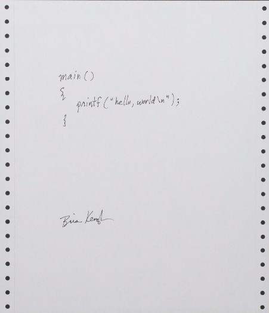
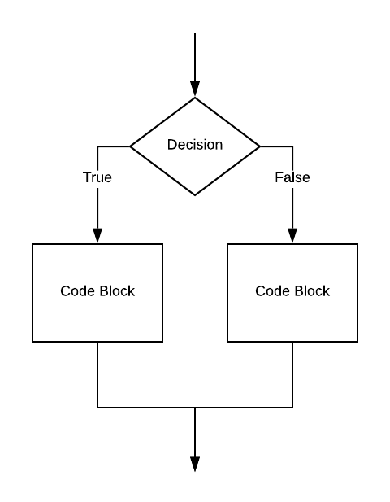

# Lesson 1 

## Prior to beginning Lesson 1

Please ensure that you have correctly and completely installed Python 3.

For windows instructions click [here](../../setup_windows.md).

For macintosh instructions click [here](badlink).

## Not Hello World

Since the introduction of the first C language book in 1978 (I got my first copy in 1979), nearly every student's first program in any programming language has been "hello, world."



In Python, this program is written as:

```python
print('hello, world')
```

Entered in interactive Python, it would look like this:

```python
>>> print('hello, world')
hello, world
>>> 
```

Surely we can agree that this would be a bit of a let down for your first coding experience.

Instead, we will use this:

```python
 0 # Your job is, at your table:
 1 # - research the various Python 3 features found in this program
 2 # - discuss the program
 3 # - write documentation (comments, like this text) describing your understanding
 4 #   of how this program works.
 5 
 6 first_name = input ("First name: ")
 7 last_name = input ("Last name:  ")
 8 total_letters = len(first_name) + len(last_name)
 9 
10 print ()
11 print ("Your first name has %d letters" % len(first_name))
12 print ("Your last name has %d letters" % len(last_name))
13 print ("All together that makes %d letters" % total_letters)
14 
15 if total_letters > 10:
16 	print ("That's a lot of letters")
17 else:
18 	print ("That's not too long to have to write all the time")
19 
20 print ()
21 print ("Sometimes your name is written like this: " + first_name + " " + last_name)
22 print ("Sometimes like this: " + last_name + ", " + first_name)
```

This program can be downloaded [here](./main.py).

## Lines 0 through 4: # introduces a comment

Lines 0 through 4 begin with ```#```. 

These are comments. 

Comments are Good.

Comments are notes to yourself and anyone else reading your code that should be used to explain your thinking. Python ignores anything after ```#```

## Lines 6 through 8 - Assignment statements

Notice on each of these lines there seems to be a left hand side (lhs) and a right hand side (rhs) divided by a single equals sign. These are examples of assignment statements. The rhs is evaluated and this evaluation is put into the variable named on the lhs.

## Lines 6 and 7: Getting typed input from the console

Lines 6 and 7 use a built-in Python function called ```input```. This function accepts a string which is printed as a prompt before Python waits for the user to enter a response (terminated when the user hits return or enter).

Trying this out in interactive Python might look like this:

```
>>> user_input = input('Yo! ')
Yo! yo
>>> user_input
'yo'
>>> 
```

## Strings can be surrounded by single or double quotation marks

Notice 'Yo! ' is surrounded by single quotation marks but in our first program ""First name: " is surrounded by double quotes. You can use either as long as you are consistent in the same string. What you start a string with, you should end with.

This means you can put a double quote into a string by using single quotes to surround and the other way around.

```
>>> print('Here is a " quote')
Here is a " quote
>>> print("Here is a ' quote")
Here is a ' quote
>>>
```

## Line 8: Addition and len()

The variables ```first_name``` and ```last_name``` contain whatever the user entered when prompted. On line 8, the length of both strings is summed into ```total_letters```. The length of ```first_name``` and ```last_name``` is taken using a call to the built-in function ```len()```. 

## Line 10: Printing a blank line

Line 10 shows a call to ```print``` with no arguments. This prints a blank line in the output.

## Lines 11 through 13: Formatted printing

There are a number of ways of formatting strings and variables in Python. These lines show one way. 

Consider the initial string, for example "Your first name has %d letters" to be a template. Notice the use of the percent sign inside the template string. The "%d" is a place holder for an integer that will be specified later in the print statement.

At the end of the template string there is found another "%". After that is an expression that will be evaluated with the resulting value taking the place of the "%d" in the template string.

## Lines 15 through 18: A *selection* statement (if)

```
15 if total_letters > 10:
16 	print ("That's a lot of letters")
17 else:
18 	print ("That's not too long to have to write all the time")
```

So far the code we have seen proceeds from one line to the next. We must have some way of introducing branches or decisions into our programs. This is done using an ```if``` statement.

The intent of lines 15 through 18 is to print one string or another depending upon the value of ```total_letters```.

Here is a picture, called a flow chart, that depicts the code from lines 15 through 18. 



The "Decision" is whether or not ```total_letters``` is greater than 10.

The "Code Block" on the left is marked with "True" - this corresponds to the code on line 16.

The "Code Block" on the right is marked with "False" - this corresponds to the code on line 18.

## The colons

Notice the colons on lines 15 and 17. These are necessary and important. On line 15, the colon ends the expression(s) that will be evaluated for True or False. It preceeds the code block that will be executed if the expression(s) evaluate to True.

On line 17, the colon coming after ```else``` precedes the code block that will be executed in the case that the expression was false.

## Indentation is **Critical**

The colons, as described above indicate the start of code blocks. What indicates when the code blocks end?

Indentation.

Indentation is the practice of leaving whitespace at the beginning of lines of code. In most languages, indenting is important but optional. Indentation helps readers of your code (including you) keep track of what code goes with or belongs to which other code. In Python, indentation serves that purpose as well but is **required**.

Lines of code that are indented to the same level are part of the same code block (assuming no intervening code lines with less indentation).

## Lines 21 and 22: String concatenation

Strings can be *added* together using the addition operator. This causes them to be combined, in order.

## Running the program

From a command prompt or terminal window, type:

```
python3 main.py
```

This runs the program (in non-interactive mode).

Let's follow it through.

```
hyde 001 $> python3 main.py 
First name: Mortimer
Last name:  Snerd

Your first name has 8 letters
Your last name has 5 letters
All together that makes 13 letters
That's a lot of letters

Sometimes your name is written like this: Mortimer Snerd
Sometimes like this: Snerd, Mortimer
hyde 001 $> 
```

Again, showing the False path of the if statement.

```
hyde 001 $> python3 main.py 
First name: Bob
Last name:  Cat

Your first name has 3 letters
Your last name has 3 letters
All together that makes 6 letters
That's not too long to have to write all the time

Sometimes your name is written like this: Bob Cat
Sometimes like this: Cat, Bob
hyde 001 $> 
```

## Exercises

### Discuss, Research and Document

Your first job is to learn the ins and outs of this code. You'll discuss what you think the code does and how it does it. You'll need to research parts of the Python 3 language. 

[Here](https://www.learnpython.org) is a good resource.

[Here](https://www.techbeamers.com/python-tutorial-step-by-step/#tutorial-list) is another good resource.

[Here](https://www.learnpython.org) is a good resource.

[Here](https://www.techbeamers.com/python-tutorial-step-by-step/#tutorial-list) is another good resource.

And of course, your zybook.

Write complete, thoughtful comments to fully document this code. Demonstrate your understanding of its purpose and operation.

### zybook assignment

In your zybook, read and perform all tasks given in chapter 4.1. Python is so gentle, I think with what you have seen so far, you can dive right into chapter 4. Cool!

### Add ALL CAPS to the program

There are some handy functions you can ask strings to perform.

| function | purpose |
| -------- | ------- |
| upper | returns the same string with all characters made upper case |
| lower | returns the same string with all characters made lower case |
| title | returns the same string with only the first letter capitalized |
| startswith | returns True if the string starts with another string |
| endswith | returns True if the string ends with another string |

Using ```upper()```, modify the program to print:

```
Sometimes your name is written like this: Bob Cat
Sometimes like this: Cat, Bob
Once in a while like this: CAT, BOB
```

### Notice interesting names

Using ```startswith()```, ```endswith()``` and ```lower()```, notice if the first name and last name have some commonality.

For example:

```
First name: Jeff
Last name:  Jefferson

Your first name has 4 letters
Your last name has 9 letters
All together that makes 13 letters
That's a lot of letters

Sometimes your name is written like this: Jeff Jefferson
Sometimes like this: Jefferson, Jeff
Cool. Your last name starts with your first name.
```

Why might you need ```lower()```? Hint -- ```endswith()```.

# Homework

Read and do chapters 1.2 and 1.3 due next class.

