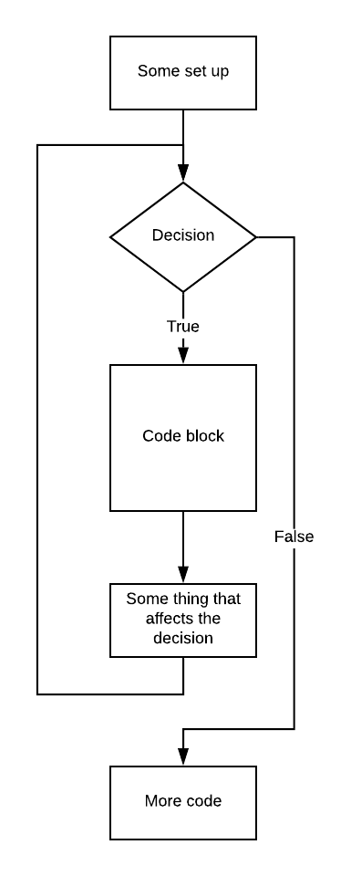

# Looping

In lesson 001 we saw that ```if``` statements let a program choose different paths through the code based upon evaluating true / false expressions. In this lesson, we will learn about how to loop over code - execute blocks of code a controlled number of times.

## A first "for" loop

Here is a version of [p1.py](./p1.py).

You can use wget to get this program using this command from the terminal:

```text
wget https://raw.githubusercontent.com/pkivolowitz/student_accessible_files/master/1100/lessons/002/p1.py
```

```python
 0 # Your job is, at your table:
 1 # - research the various Python 3 features found in this program
 2 # - discuss the program
 3 # - write documentation (comments, like this text) describing your understanding
 4 #   of how this program works.
 5 
 6 import webbrowser
 7 
 8 for i in range(0, 16):
 9 	  print ("na", end="")
10 
11 print (" Batman!")
12 
13 response = input("Play the video? (yes or no): ")
14 if response == "yes":
15 	  webbrowser.open_new_tab("https://www.youtube.com/watch?v=VSaDPc1Cs5U")
```

Here is a flowchart showing how a for loop works:



In the code above, the "Some set up" puts 0 into ```i```. 

The "Decision" is "is there anything more to put in ```i```?" 

If true, line 9 is executed. 

The "Some thing that affects the decision" is putting the next output of the range into ```i```.

The arrow that proceeds out of the box marked "Something that affects the decision" arcs to the left and goes back above the "Decision". This is the **loop** in the **for loop**. 

### Line 6

```python
import webbrowser
```

Python is especially great for a number of reasons. Certainly is a gentle language to learn. And, as demonstrated here, there are prebuilt libraries for so many things. Line 6 imports a library that gives your program easy ways to control a web browser. This library will be used on line 15.

### Line 8 - range()

```python
for i in range(0, 16):
```

The for loop names a variable (in this case ```i```) and is going to assign this variable each value ```in``` a series of values. In this case, we will get the series of values from a Python function named ```range()```. The ```range()`` on line 8 in p1.py will generate the integers from 0 through 15 incrementing upward by 1 for each loop.

```range()``` can be used in a number of ways. Using interactive Python, let's look at a few examples:

Here is counting backwards by 1:

```python
>>> for i in range(5,3,-1):
...     print(i)
... 
5
4
>>> 
```

Here is what you get when you specify only one argument:

```python
>>> for i in range(3):
...     print(i)
... 
0
1
2
>>>
```

Here we will go from the starting value upwards by 2 each time. 

```python
>>> for j in range(10, 20, 2):
...     print(j)
... 
10
12
14
16
18
>>>
```

*Notice in all these examples, the ending value is not included in the values generated.*

### Line 9 - Printing without an ending new line

```python
print ("na", end="")
```

This ```print()``` statement shows us a new idea:

*Named parameters* in Python you can specify arguments in any order by prefacing them with their name in sort of an assignment statement. Here, the parameter with name ```end``` gets set with a null string. If you don't specify a value for ```end``` it defaults to the new line.

Compare the output of:

```python
for i in range(3):
	print('na')
```

with:

```python
for i in range(3):
	print('na', end='')
```

### Lines 13 to 15

```python
response = input("Play the video? (yes or no): ")
if response == "yes":
 webbrowser.open_new_tab("https://www.youtube.com/watch?v=VSaDPc1Cs5U")
```

You've seen ```input()``` before. If the user answers "yes", they are treated to the source of the words in the print out. Hopefully, you don't get too obnoxious an ad from YouTube. Commericialism and Capitalism have ruined the Internet, btw.

## Exercises

### Experience an error

Remove line 6 by making it a comment. Rerun the program. Familiarize yourself with the error message - you will see it often :( Remember to activate line 0 again to remove the error.

### Experience another error

Remove the leading tab from line 9. Rerun the program. Familiarize yourself with the error message - you will see it often :( Remember to fix this before moving on.

### zybook assignment

Read and do the exercises in chapter 5.5 and 5.6 of your zybook. Complete at least 5.5. Chapter 5.6 will also be assigned as homework on the chance you cannot get to it in class.

### Nested for loop

The start of the Beatles "She Loves You" goes like this:

```
She loves you, yeah, yeah, yeah
She loves you, yeah, yeah, yeah
She loves you, yeah, yeah, yeah
```

There are three repetitions of the line ```She loves you, yeah, yeah, yeah```. At the end of each line there are three repetitions of ```yeah, yeah, yeah```.

This can be viewed as an *outer loop* and an *inner loop*. The outer loop repeats the three lines. The inner loop repeats the last three words of each line.

Create your first program from scratch. Use two ```for``` loops, one nested within the other, using ```range()``` in each to print out the lyrics properly.

[Here](https://www.youtube.com/watch?v=nGbWU8S3vzs) is a link to the song, if you haven't heard it before. Play it later.

# Homework

Read and do chapters 1.4, 1.8, 2.1, 5.1 and 5.6 due the next class meeting.
