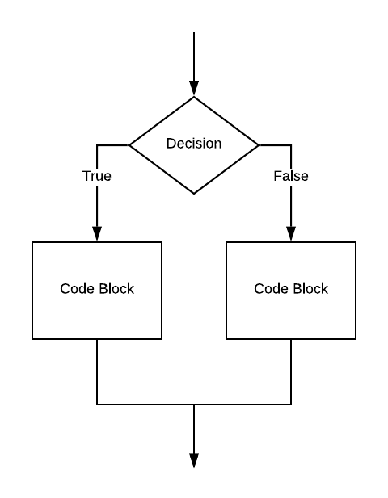
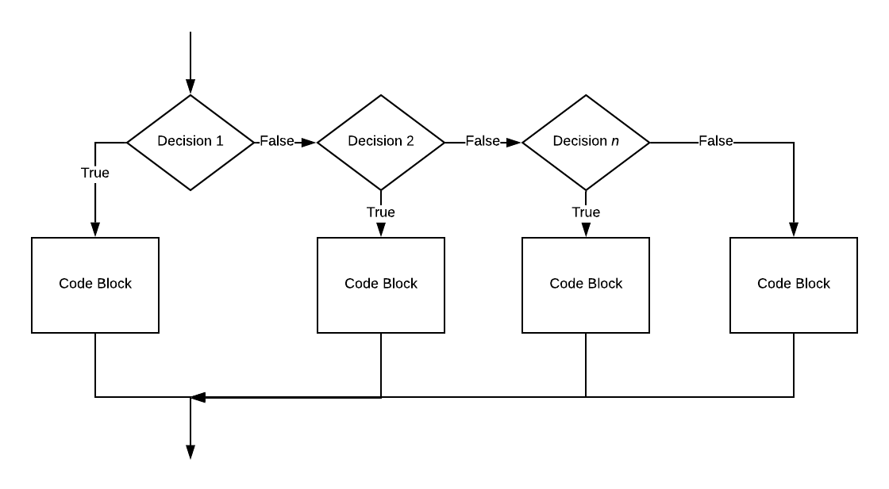
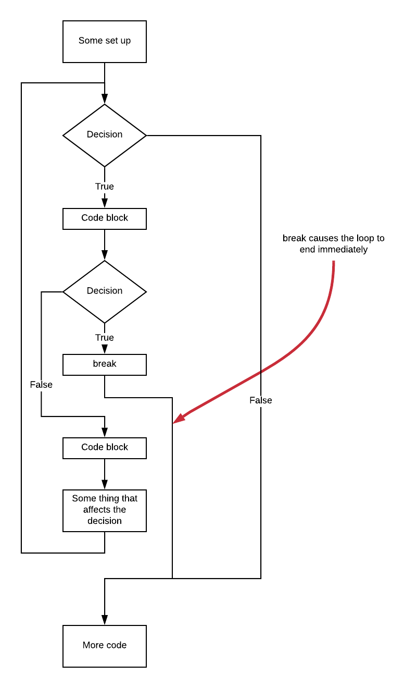
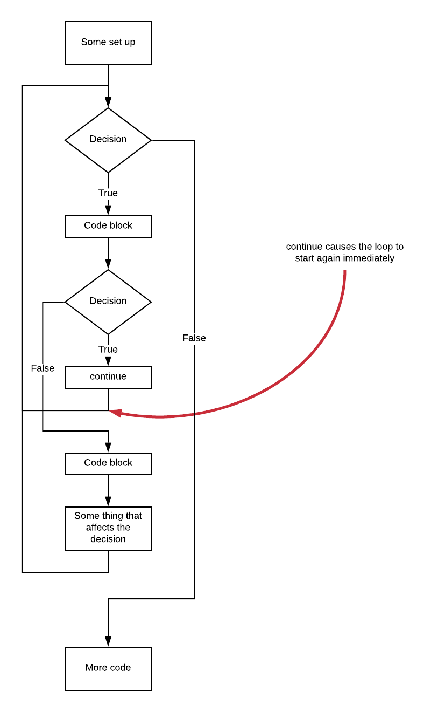

# Looping 3 - Random numbers and more about looping

This lesson combines a good deal of new learning. 

## Random numbers

Computers, are made to be *deterministic* - that given the same input a program should always produce the same output. On the other hand, computers are used very often to calculate simulations of physical events or to calculate probabilities of certain outcomes. In these cases, a source of randomness is key.

For example, suppose we were to simulate the rolling of a pair of dice one billion times. We can either roll an actual pair of dice one billion times to prepare a list of actual outcomes for processing by a computer, or we can simulate the random output of those billion rolls directly upon the computer.

In interactive Python do the following:

```python
>>> from random import seed, randint
```

We're now ready to produce an endless stream of "random" integers.

Why do we put "random" in quotes? Think about it... Reread the first paragraph... 

Got it now?

Right! Computers are designed to be deterministic - without the aid of special hardware, the best we can do is devise an algorithm that produces a sequence of outputs that doesn't repeat for a very very long time.

(Some computers, such as the PyBoard we will get a chance to play with later in the course, have hardware support for generating random numbers.)

Here is a [link](https://thepythonguru.com/python-generating-random-numbers/) to a tutorial page on random numbers in Python:

### randint()

Back in interactive Python type:

```python
randint(0, 99)
```

three times. We might get output looking like this:

```python
>>> randint(0, 99)
88
>>> randint(0, 99)
23
>>> randint(0, 99)
71
>>>
```

The function ```randint()``` takes two arguments which must be integers. Try this:


```python
randint(0, 99.2)
```

You ought to get a pretty nasty looking error. The reason? Here, our second argument was not an integer.

The first argument establishes the minimum value to be returned. The second argument establishes the maximum value to be returned.

### seed()

Try entering these statements into interactive Python:

```python
>>> seed(0)
>>> randint(0,99)
>>> seed(0)
>>> randint(0,99)
```

Compare the output of the first call to ```randint()``` to the second call. Are the results the same? That's not very random is it?

The ```seed()``` function sets the initial input to the algorithm used to generate the "random" sequence. Sometimes it is good to be able to run the *same* random number based simulation a number of times - for example for debugging and testing purposes.

```seed()``` can also be called with no argument. In this case, the current time is used as the initial input to the algorithm. This, naturally, will be different every time ```seed()``` is called.

It is unlikely that we ever need to call ```seed()``` with no arguments more than once in a single program execution.

### random()

If you want floating point numbers, use ```random()``` instead of ```randint()```. Floating point numbers are numbers with fractional parts.

In interactive Python try this:

```python
>>> from random import random
>>> random()
output here
>>> random()
output here
>>> random()
output here
>>>
```

The value returned by ```random()``` will range from 0 up to but not including 1.

More about the ```import``` variation we're using here comes soon.

## p3.py

Here is the program we will learn from:

```python
 0 # Your job is, at your table:
 1 # - research the various Python 3 features found in this program
 2 # - discuss the program
 3 # - write documentation (comments, like this text) describing your understanding
 4 #   of how this program works.
 5 
 6 
 7 from random import seed, randint
 8 
 9 seed()
10 
11 for i in range(1, 11):
12 	die_value = randint(1, 10)
13 	if die_value == 5:
14 		print ("The ten sided die came up with 5 - breaking the loop when the loop index was: %d" % i)
15 		break
16 	elif die_value == 6:
17 		print ("The ten sided die came up with 6 - we're skipping loop index %d using a continue statement" % i)
18 		continue
19 	print ("For loop index: %d nothing special happened" % i)
20 
```

You can get this program with this:

```
wget https://raw.githubusercontent.com/pkivolowitz/student_accessible_files/master/1100/lessons/004/p3.py
```

### Line 7 - the import

Here we import ```seed()``` and ```randint()``` from the ```random``` library. We haven't seen this variant on ```import``` before. We've just seen this:

```python
import webbrowser
```

This imports the *whole* named library.

The variant we use here only imports what we need from the library.

```python
from random import seed, randint
```

Which one should you use? It depends. If we are unsure of what resources of a library we can import the whole thing. In this case, we know we need only the two functions we've discussed.

### Line 9 - seed()

As discussed above, the call to ```seed()``` uses the time of day as the initial value for the random number generating algorithm.

### Line 12 - randint()

```randint()``` with arguments 1 and 10 will return randomly chosen values from 1 up to and including 10.

### Lines 14 and 17 - a new variant of the IF statement

Let's review the ```if``` statement. The one we saw in lesson 1 looked like this:



for code that would look like this:

```python
if some_boolean_expression:
	# code block on the left
else:
	# code block on the right
```

An ```if``` statement can also look like this:


for code that looks like this:

```python
if some_boolean_expression:
	# code block labeled "Process"
```

If the decision evaluates to false, the code block is simply skipped.

To recap, so far we have looked at:

*If this do that or do some thing else*

and

*If this do that*

Now we have one more variant:

*If this do that or if this(2) do that(2) or if this(3) do that(3) etc.*

Take a look at this flowchart:



Note that the rightmost part of the picture is optional. In p3.py, for example, we're not using a final ```else```.

The code matching the flowchart above would look like this:

```python
if condition_1:
	# code block 1
elif condition_2:
	# code block 2
elif condition_3:
	# code block 3
else:
	# code block 4
```

### Line 15 - the break statement

A ```break``` statement prematurely and immediately ends the *(nearest)* loop it is found *in*. ```break``` must be contained within a for loop (or other types of loops to be covered in the future).



### Lines 13 to 15

The effect of these lines is that should the die roll come up with a 5, a message will be printed and the loop terminated. Notice when you run this that line 19 is not printed. This is because the loop has terminated immediately on executing the ```break```.

### Line 16 - elif

We want to perform an additional test on the result of the die roll. If the die is not 5 then we will test to see if it is 6.

### Line 18 - continue

```continue``` is like break in that it is valid only within loops. Instead of forcing a loop to terminate immediately as ```break``` does, ```continue``` causes the next iteration of the loop to begin immediately.



### Lines 16 to 18

The effect of these lines is that should the die roll come up with a 6, a message will be printed and the next iteration begins immediately. Notice when you run this that line 19 is not printed.

## Some discussion on continue and break

Both of these keywords are used inside loops.

Both of these keywords are typically found in the body of if statements.

Both of these keywords alter the sequence of instructions.

- In the case of continue, control transfers to the top of the nearest surrounding loop.

- In the case of break, control transfers beyon the end of the loop.

## Output of the program

```
$> python3 p3.py 
For loop index: 1 nothing special happened
For loop index: 2 nothing special happened
For loop index: 3 nothing special happened
For loop index: 4 nothing special happened
The ten sided die came up with 5 - breaking the loop when the loop index was: 5
$> 
```

Here, of the fifth loop, a die roll of 5 came up so the loop ended due to coming upon a ```break```.

```
$> python3 p3.py 
For loop index: 1 nothing special happened
For loop index: 2 nothing special happened
For loop index: 3 nothing special happened
For loop index: 4 nothing special happened
For loop index: 5 nothing special happened
For loop index: 6 nothing special happened
For loop index: 7 nothing special happened
For loop index: 8 nothing special happened
For loop index: 9 nothing special happened
For loop index: 10 nothing special happened
$>
```

Here, no 5's or 6's came up to all the loops ran to completion.

```
$> python3 p3.py 
For loop index: 1 nothing special happened
For loop index: 2 nothing special happened
For loop index: 3 nothing special happened
The ten sided die came up with 6 - we're skipping loop index 4 using a continue statement
For loop index: 5 nothing special happened
For loop index: 6 nothing special happened
For loop index: 7 nothing special happened
For loop index: 8 nothing special happened
For loop index: 9 nothing special happened
For loop index: 10 nothing special happened
$> 
```

Here, on loop number 4, a 6 came up so the loop began its next iteration due to coming upon a ```continue``` statement.

## Exercises

### zybook assignment

Read and do the exercises in chapter 4.5 of your zybook.

Next, read and do chapter 4.7 of your zybook. This will also be part of your homework in case you don't get this far in class.

### Discuss, research and document

This is the last lesson where you will be given a complete explanation of the code. Take this opportunity to practice researching each keyword that is new on your own so that you may do this when you're working on your own.

### Alter the program to ```continue``` on 6 OR 7

Having done so, change the program to print using:

```python
print("The ten sided die came up with 6 or a 7 - we're skipping loop index %d using a continue statement" % i)
```

### Alter the program so that if you roll...

Add an ```if``` statement that will execute a ```break``` if you roll a 3 and the loop index is less than 4.

# Homework

Read and do chapters 2.3, 4.7 and 5.10. These are due at the next class meeting.
