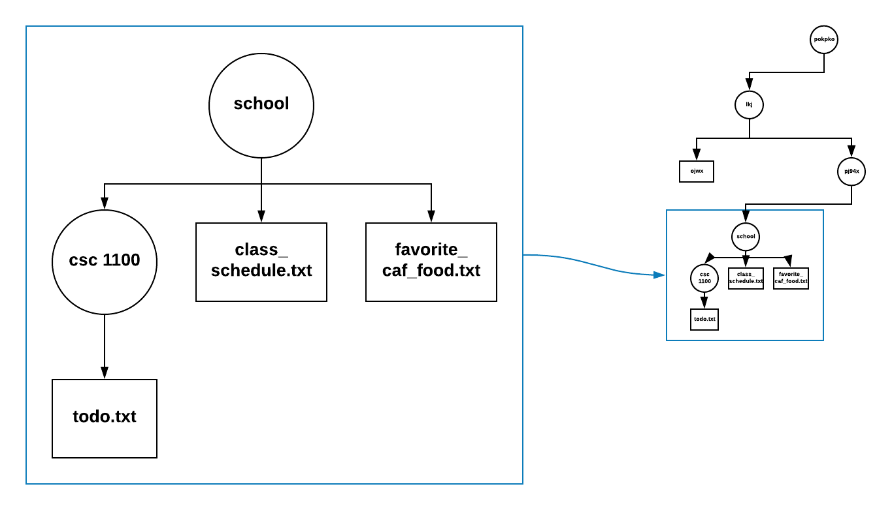

# Lesson 8 - Enumerating files

Files are stored in directories - you might be more familiar with the term "folder". The next few programs we learn about how to enumerate all the files in a directory *and* all the files in all the directories beneath. This is a very useful technique which you might need to use in your programs. We are heading towards learning from a program that prints information your mp3 library (if stored on your computer).

## Directory (folder) structure

All of the files on your computer are organized into a tree structure. In the picture below, you might have a directory (or folder) called "school" under which you place all your work. This is shown at the left. But notice how all your school work is itself just part of a larger tree (on the right).



In text form you can see the contents of a directory in the Linux and Macintosh commnd prompt like this:

```
$ ls -la
total 32
drwxr-xr-x 1 perry perry    74 Jun 22 20:48 .
drwxr-xr-x 1 perry perry   190 Jun 22 20:48 ..
-rw-r--r-- 1 perry perry   600 Jun 22 20:48 enumerating_files.py
-rw-r--r-- 1 perry perry 20917 Jun 22 20:48 hier.png
-rw-r--r-- 1 perry perry  3545 Jun 22 20:48 README.md
```

In the left most column, there is informaion about access rights. In the middle can be found ownership information. After that is listed each file's size. All the way on the right you can see the file's name.

Two of these lines begin with the letter "d". This means they are directories and not plain files. They have funny names though.

### dot and dot dot

When you open a folder in Finder or Explorer the contents of the folder are "just there". Where? In the folder you opened. 

It's like the great master of all things Buckaroo Banzai said ["No matter where you go, there you are."](https://www.youtube.com/watch?v=xnEAPBpSqLQ)

Specifically, every folder has a name for itself. It calls itself '.' or dot.

Every folder has a name for the folder above it. It calls its parent '..' or dot dot.

In the program below, look at line 9, repeated here:

```python
starting_dir = '.'
```

This means that the program will start enumerating files from the current directory. Note that this starting place can be overridden by command line arguments - which you are now expert in!

## enumerating_files.py

```python
 0 # Your job is, at your table:
 1 # - research the various Python 3 features found in this program
 2 # - discuss the program
 3 # - write documentation (comments, like this text) describing your understanding
 4 #   of how this program works.
 5 
 6 import os
 7 import sys
 8 
 9 starting_dir = '.'
10 
11 if (len(sys.argv) > 1):
12 	starting_dir = sys.argv[1]
13 
14 # The first argument must in fact, be a directory. Exit if it isn't.
15 if not os.path.isdir(starting_dir):
16 	error_string = starting_dir + ' is not a directory or cannot be found'
17 	sys.exit(error_string)
18 
19 for root, d, f in os.walk(starting_dir):
20 	for file in f:
21 		print(file)
```

### Line 6 - import os

The "os" library provides a lot of useful functions that give you access to services provided by your operating system (such as MacOS, Linux or Windows). There's a teachable moment here - different operating systems provide many services in common but they do it in different ways. Python provides a "wrapper" which "abstracts" the differences away.

Abstraction is one of the "Great Ideas" of Computer Science. In this case the abstraction provided by the "os" library makes all the operating systems look alike. The code which does this is called the "wrapper."

## Nested loop

Before you are turned loose to work on your own, here is a bit more explication.

This may be the first time we have seen a *nested loop*. A nested loop is one loop found within another loop. You have seen nested loops IRL. The one's digit in a car's odometer is a loop from 0 to 9. It itself is nested in a loop for the tens digit. The tens digit is nested in a loop for the hundres place. Etc.

This says: f is a list of file names, assign *file* to every member of the list one at a time.


## Exercises

### zybook assignment

This will help you understand nested loops - read and do chapter 5.8 of your zybook.

### Discuss, Research and Document

Discuss what you think the code does and how it does it. You'll need to research parts of the Python 3 language. 

[Here](https://www.learnpython.org) is a good resource.

[Here](https://www.techbeamers.com/python-tutorial-step-by-step/#tutorial-list) is another good resource.

And of course, your zybook.

Write complete, thoughtful comments to fully document this code. Demonstrate your understanding of its purpose and operation.

### Experiment and modify

Try the program a few times.

Try:

```python3 enumerating_files.py .```

and

```python3 enumerating_files.py ..```

If you get too many files, you can halt the program by depressing the control and c keys together.

### What other information can you get from ```os``` about files?

#### File size

Add printing the file's size to each output line. Research ```os.path.getsize()```.


### What other information can you get from ```os```?

#### Operating environment

Read and research ```os.name```. Using interactive Python try it out. Find someone in class who has a different OS than you and ask them what they get.

#### The current directory

Every program has a notion of where "it is" in the file system. 

Read and research the function ```os.getcwd()```. The "cwd" standard for "current working directory."

## Homework

Read and do chapter 5.12. Note how this makes doing one of the exercises in the last lesson easier. Which one?

Read and do chapters 2.7 and 2.8.

