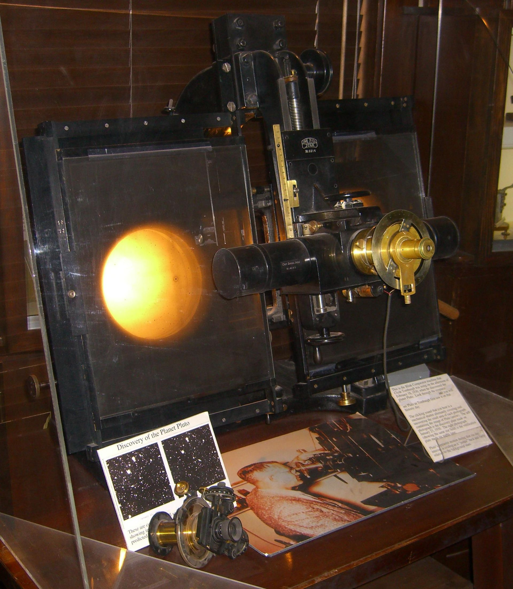
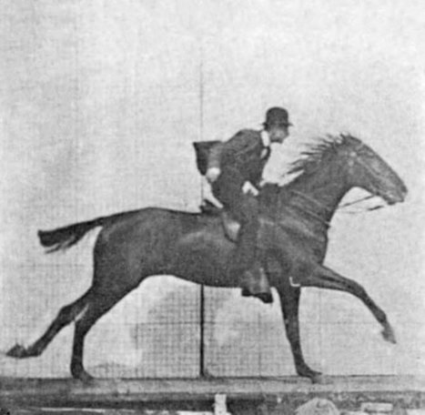

# Blick Comparator

The Blink Comparator is by today's standards an incredibly simple device. Using it, two images could be flipped one to the other and back to the first. The idea is that any differences between the two images would be easy to detect. Clyde Tombaugh used the one below to discover Pluto in 1930.



We will write a program in a few lines of Python to duplicate Tombaugh's discovering using the very same images.

After that *you* will rewrite the program to take another trip down memory lane to display this:



from ~1872.

## opencv

We will be using the OpenCV package for Python. OpenCV is a *super comprehensive* suite of computer vision software routines used in thousands of applications in robotics, visual effects, image editing and self-driving cars to name a few.

The required packages should already be installed. Test this using interactive Python.

```text
> python3
Python 3.6.9 (default, Nov  7 2019, 10:44:02) 
[GCC 8.3.0] on linux
Type "help", "copyright", "credits" or "license" for more information.
>>> import cv2
>>> exit()
>
```

Remember, on your computer you may need to type `python3` or just `python` and you will likely get a different Python version - which **must** begin with 3.

## Step 1 - ensure the two pictures are in the right place

1. Create a folder called `blink`
2. Download [p1.jpg]() and [p2.jpg](). They are in the zip file [pluto.zip]().
3. Put both in the folder named `blink`
4. Start a program called `blink.py`
5. Enter:

```python
import cv2

images = []
images.append(cv2.imread('p1.jpg'))
images.append(cv2.imread('p2.jpg'))
```
6. Save and run this program. If there is no output, all is well. If any errors occur, all is not well.

---
<center>
<i>What's the point of coding so little and then testing?</i>
<br/>
<b>Coding so little and testing is EXACTLY the point.</b>
</center>

---

### Discussion

Our goal is to switch between two images, to *ping-pong* between them so to speak. 

`images` is declared as an empty list.

`cv2.imread()` is given the name (or path) to the image to load. The return value is immediately appended to `images`. Note that this code does not perform well in the presence of errors. In fact, it performs no error checking at all.

After executing this code, `images[0]` and `images[1]` contain the image information for `p1.jpg` and `p2.jpg`

## Step 2 - Enter remaining lines of code

7. Append the following to the code:

```python
current_index = 0
key = ''
while key != 'q':
    cv2.imshow('Pluto', images[current_index])
    cv2.setWindowTitle('Pluto', str.format('Pluto Image: %d   -   \'q\' to quit' % current_index))
    key = chr(cv2.waitKey(0))
    current_index = 1 - current_index
cv2.destroyAllWindows()
```

8. Save and run this program. This program should open a window. If you see nothing and the program has not exited or generated an error, it is possible that the new window opened *underneath* other windows and is obscured.

9. With the new window selected hit any key other than `q`

10. Find Pluto

11. Hit `q` to exit

### Discussion

####  `cv2.imshow()`

This usage of the OpenCV function `imshow()` takes two parameters. The first serves as a window **ID**. Any OpenCV window relation function that supplies the same value will refer to the same window. The second parameter is what image to show within the window.

#### `cv2.setWindowTitle()`

Notice the first argument is the same as the call to `imshow()`. This function sets the contents of the window title.

#### `cv2.waitKey()`

This causes your program to wait indefinitely for keyboard input. The return value of this function is a numeric key code. The code can be turned into a character using `chr()`.

#### current_index

This integer will ping-pong from 0 to 1 each time a key other than `q` is depressed. `current_index` starts out at 0. Thereafter `current_index = 1 - current_index` will flip it back and forth. When `current_index` is zero, `images[0]` is shown. When `current_index` is 1, `images[1]` is shown.

#### `cv2.destroyAllWindows()`

This function does what it says. Use it before exiting a program that uses OpenCV windows.

#### The "gist" of the main loop

The loop continues until the user hits the `q` key. On any other key, the displayed image alternates between picture 1 and picture 2 based upon `current_index`.

## Your turn - making a flipbook from the Muybridge Horse photos

On June 19th, 1878 Eadweard Muybridge set up one dozen cameras with trip wires to settle a long standing question. Was there a time when all of a horse's hooves are off the ground at the same time.


Expanding on what you've learning above, you will create a flipbook that lets you run forwards or backwards over 12 images. If the user hits the `a` key, the `current_index` should decrement by 1. If the user hits the `s` key, the `current_index` should be incremented by one. As before, if the user hits the `q` key, the program should end.

Clearly `current_index` will grow beyond the number of images defined in the sequence and this would cause an `index error`. Similarly, if going backwards, `current_index` can become negative which will also end in tears.

You will need to keep `current_index` in the right range. Perhaps the `%` operator can be of assistance?


