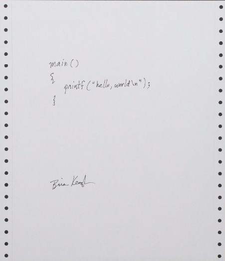

# A non-traditional beginning

Every programming course I have seen since the publication of Kernighan and Ritchie's "The C Programming Language" begins with the classic "Hello World" program. Here is a picture of the original:



As you can see, it is full of exciting innovation. It prints *"hello, world"*.

I have decided this term, we will not start in the traditional manner. I thought about how I started out (at this point, 45 years ago) and I recalled that I initially learned languages by reading code written in those languages.

Inspired by a conversation with my [son](./evan.jpg), let's try that this term.

## Learning by exploration

Here's some code. Discuss it with your neighbors. You may have absolutely no idea what this all means - that's the point. See what you can gather by feel and intuition.

```c++
 0 #include <iostream>
 1 #include <ctime>
 2
 3 using namespace std;
 4
 5 int main() {
 6      srand(uint32_t(time(nullptr)));
 7      int max_value = 100;
 8      int secret_number = (rand() % max_value) + 1;
 9      int counter = 0;
10      int guess;
11
12      while (true) {
13              cout << "Enter a guess between 1 and 100: ";
14              cin >> guess;
15              counter++;
16              if (guess > secret_number)
17                      cout << "Lower" << endl;
18              else if (guess < secret_number)
19                      cout << "Higher" << endl;
20              else {
21                      cout << "Right! You needed " << counter;
22                      cout << " tries to get it!" << endl;
23                      break;
24              }
25      }
26      return 0;
27 }
```

## Questions to answer

### What does this do?

There seems to be some set up that associates names with values. Then, there seems to be some kind of loop, What does this program do?

### What does the indentation suggest?

It looks like a lot of trouble to indent some lines and some lines more than others. Is there a pattern to the indentation?

### What does ```int``` mean and what does the rest of the line appear to do?

Lines 7 through 10 start with ```int``` and then have more stuff. What's this all about?

### What does ```cin``` and ```cout``` do?

There is one instance of ```cin``` and a lot of instances of ```cout```. What do you think they are doing?

### What are the braces?

The characters *{* and *}* are called braces. What does it look like they are doing? Do they have a relationship to the indentation? If braces and indentation go together, why do lines 17 and 19 not have braces but lines 21 to 23 are surrounded by braces?

### What does ++ do?

On line 15 there is ```counter++```. What is that doing?

### What are the semicolons?

Why do some lines end with them (most, actually) and some do not?

### How does this program end?

Programs are typically designed to end. How (and where) does this program terminate?

## Homework

### Continue software installation if necessary

Follow the directions to install software for CSC 1810. The instructions are located [here](https://github.com/pkivolowitz/student_accessible_files)

### zybooks readings

Read and do chapters 1.1, 1.2 and 1.3. These are due by the next class.
