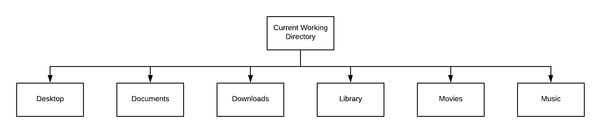
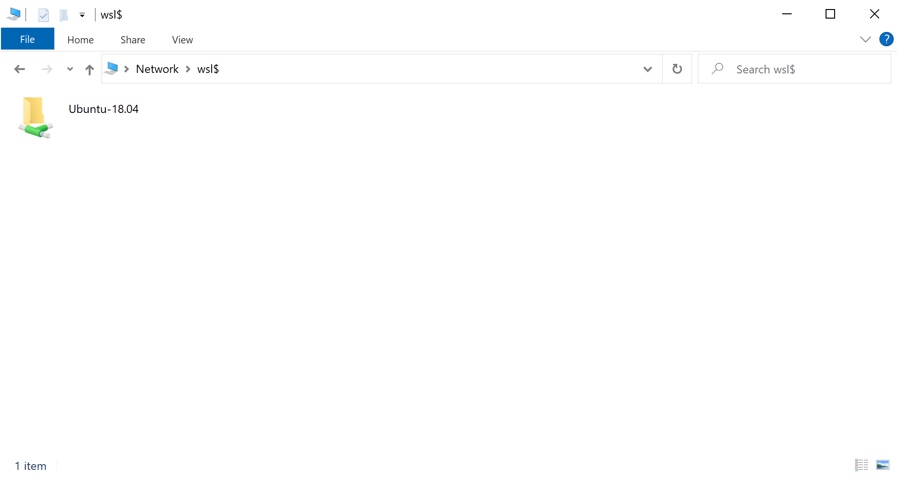
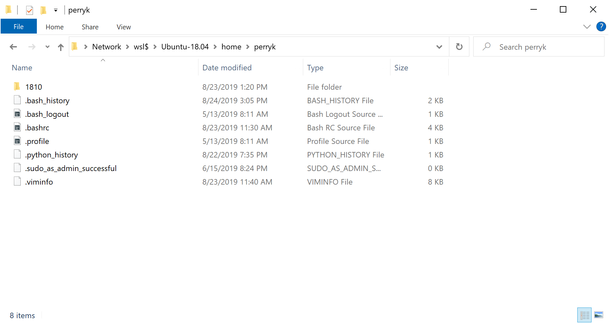

# Learn by exploration

Here is another program:

```c++
 0 /*
 1 CSC 1110 - Fall 2015
 2 Perry Kivolowitz
 3 Carthage College
 4 
 5 Fun with IF and logical operators.
 6 */
 7 
 8 #include <iostream>
 9 
10 using namespace std;
11 
12 int main(int argc, char *argv[])
13 {
14  	int age_1, age_2;
15  
16  	cout << "Enter two ages with a space inbetween: ";
17  	cin >> age_1 >> age_2;
18  
19  	if (age_1 >= 16 && age_2 >= 16)
20  		cout << "Both can drive." << endl;
21  
22  	if (age_1 >= 21 || age_2 >= 21)
23  		cout << "At least one can rent a car." << endl;
24  
25  	if ((age_1 >= 25 && age_2 < 25) || (age_1 < 25 && age_2 >= 25))
26  		cout << "One can be a senator." << endl;
27  
28  	if (age_1 < 35 && age_2 < 35)
29  		cout << "Neither can be President." << endl;
30  	return 0;
31 }
```

## Questions to answer

Discuss the above program with your table mates. Answer these questions.

### What does this do?

It looks like age_1 and age_2 will get input from the user (line 17) after a prompt (line 16). The what happens?

### What do you think ```<<``` is doing?

```<<``` appears on lines 16, 20, 23, 26 and 29. What do you think it is doing?

### What do you think ```endl``` does?

```cout``` seems to print stuff. You've talked about ```<<```. At the end of lines 20, 23, 26 and 29 there is ```<< endl;``` What do you think this is doing? What's the difference between these lines and line 16?

### What does ```&&``` and ```||``` do?

Work out what lines 19, 22, 25 and 28 are doing.

### What would this program print if...

| age_1 | age_2 |
| ----- | ----- |
| 50 | 90 |
| 50 | 10 |
| 50 | 30 |
| 10 | 12 |

### What does the ```/*``` and ```*/``` appear to do?

Notice that what appears between ```/*``` and ```*/``` is even set off in a different color. What's that about?

### How does this program end?

Programs are typically designed to end. How (and where) does this program terminate? Are there any loops in this program?

## SKIP TO HOMEWORK - MAC USERS CAN READ THIS AT LEISUR

Nearly the rest of this document refers to the WSL environment. Some of it also applies to the Mac so if you have one, you can read this at home.

## Continue with setting up the command line environment

Read and do this [page](https://github.com/pkivolowitz/student_accessible_files/blob/master/setup_2.md) if you have not done so already.

### Commands we will start with

| command | purpose |
| ------- | ------- |
| cd | Changes your *working directory* |
| cp | Copies file or files to another name / place |
| ls | Lists what is in the *working directory* or another directory |
| mkdir | Makes a directory |
| mv | Renames / moves a file or files to another name / place |
| pwd | Prints the *working directory* |
| rm | Removes / deletes file or files |

#### Navigation

In a command line environment, at every moment you are in some *directory*. This is called the *current working directory*. Directories are the same thing as folders in the environment you are accustomed to. Upon your entry into the command line environment, you "land" in your *home directory*.

When you enter the command line the first time on Windows, your home directory is (seemingly) empty.

```text
perryk@bandage:~$ ls
perryk@bandage:~$
```

When you enter the command line the first time on the Mac, your home directly *might* look *something like* this:

```text
Last login: Fri Aug 23 10:12:51 on ttys000
hyde:~ test$ ls
Desktop		Downloads	Movies		Pictures
Documents	Library		Music		Public
hyde:~ test$
```

When the command line is ready to accept your next command, it displays a prompt. What is in the prompt can be changed, hence the two prompts above are different.

Mac: ```hyde:~ test$```

Windows: ```perryk@bandage:~$```

Both end with ```$``` - this is convention. They also both given certain other information such as the user name, machine name and the current working directory. On the Mac, the machine name is ```hyde``` and the user is ```test```. On Windows, the machine name is ```bandage``` and the user name is ```perryk```. 

What about the current working directory? Do you see it?

It's the ```~```. ```~``` is the shortcut name for your home directory. ```~``` always refers to the same place (for you) - your home directory.

You can determine your current working directory using the ```pwd``` command.

On the Mac:

```text
hyde:~ test$ pwd
/Users/test
hyde:~ test$
```

On Windows:

```text
perryk@bandage:~$ pwd
/home/perryk
perryk@bandage:~$
```

The layout of files in a Unix-like system is hierarchical. It is a tree structure. Computer Scientists draw trees with the root at the top. A funny thing about tree structures... you can think of every branch point as the root of the tree structure that comes below it.

Recall this output from the Mac:

```text
Last login: Fri Aug 23 10:12:51 on ttys000
hyde:~ test$ ls
Desktop		Downloads	Movies		Pictures
Documents	Library		Music		Public
hyde:~ test$
```

This can be pictured like this (with Pictures and Public left out):



The current picture for Windows wouldn't have anything in it except for "Current Working Directory".

In the image above, what directory is "Current Working Directory"? Well, on the Mac, recall:

```text
hyde:~ test$ pwd
/Users/test
hyde:~ test$
```

So, think of "Current Working Directory" as being fungible. The CWD is where ever you are.

In the words of the sage, Buckaroo Banzai:

```text
"no matter where you go, there you are"
```


#### Recap so far

* A Unix (Linux) file system is hierarchical
* Where you *are* is always your current working directory
* Use ```pwd``` to print your current working directory
* Use ```ls``` to print the contents of your current working directory

#### Making directories

Take a moment to choose the name of a directory under which you'll organize all the work from this class. This is the same thing as choosing a folder name (directories <==> folders).

Suppose the name you choose is ```1810```.

*While in your home directory* type:

```mkdir 1810``` and hit return / enter. 

You have just created a directory called ```1810```.

```text
perryk@bandage:~$ ls
perryk@bandage:~$ mkdir 1810
perryk@bandage:~$ ls
1810
perryk@bandage:~$
```

#### Switching current working directories (to a named directory)

You change your current working directory using the ```cd``` command.

```text
perryk@bandage:~$ pwd
/home/perryk
perryk@bandage:~$ ls
1810
perryk@bandage:~$ cd 1810
perryk@bandage:~/1810$ pwd
/home/perryk/1810
perryk@bandage:~/1810$ ls
perryk@bandage:~/1810$
```

The above shows that I started in my home directory. This is evidenced by the first ```pwd```. In that directory was the subdirectory ```1810```. I used the ```cd``` (change directory) command to descend into 1810. The second ```pwd``` shows I've gone one level deeper into the file system hierarchy. The final ```ls``` shows there is nothing  in the directory 1810.

#### Going up one level

The notion of "current working directory" is relative. Remember what the sage said:

```text
"no matter where you go, there you are"
```

No matter what directory you are currently in, it has a pseudonym of ```.``` (dot).

```text
perryk@bandage:~$ ls
1810
perryk@bandage:~$ ls .
1810
perryk@bandage:~$
```

In the above, you see that listing the contents of the current working directory (the call to ```ls``` with no arguments) is the same as asking ```ls``` to list the contents of ```.```

There are two other directories that have special shortcuts. You have seen one: ```~``` which stands in for your home directory.

```text
perryk@bandage:~/1810$ pwd
/home/perryk/1810
perryk@bandage:~/1810$ ls
perryk@bandage:~/1810$ ls ~
1810
perryk@bandage:~/1810$
```

Here, we are in the 1810 directory. Doing an ```ls``` shows it is empty. However, doing ```ls ~``` shows us the listing of your home directory.

The third directory that has a shortcut is *the parent of the current working directory*. This shortcut is ```..``` (dot dot). No matter where you are (with only one exception), the directory above the current directory can be referred to by ```..```

```text
perryk@bandage:~/1810$ cd ..
perryk@bandage:~$
```

At any time, if you ```cd``` with no arguments, you change back to your home directory.

```text
perryk@bandage:~/1810$ pwd
/home/perryk/1810
perryk@bandage:~/1810$ cd
perryk@bandage:~$ pwd
/home/perryk
perryk@bandage:~$
```

This shows that I was in 1810, then after executing ```cd``` with no arguments, I was switched to my home directory.

#### Critical - Windows Only

WSL isn't *exactly* fully inside Windows. Specifically, there is a separation between Windows files and WSL files. **When Ubuntu is running (open)** open a Windows Explorer window. Type ```\\wsl$``` in the navigation bar. You should see this:



Then, navigate to your home directory and use Windows Explorer as you would normally.



#### OR

```cd``` to the directory you want to work in. For example:

```cd 1810```

Then type:

```explorer.exe .```

Here is an example: 

```text
perryk@bandage:~$ cd 1810
perryk@bandage:~/1810$ explorer.exe .
perryk@bandage:~/1810$
```

When it is time to turn in work, for example, you can use this technique to get "native" access to your WSL work. WSL work. WSL work. Say that 10 times fast.

#### Recap

* ```.``` is the name of the current working directory
* ```..``` is the name of the current working directory's parent
* ```~``` is the name of your home directory
* ```mkdir``` is the command that creates subdirectories
* ```cd``` is the command that changes your current working directory
* ```cd``` with no arguments changes your current working directory to your home directory
* WSL files are located on a "network" share on your native Winsows system.

## Homework

### zybooks readings

Read and do zybooks chapters 1.4, 1.6 and 1.7. These reading are due at the next class.

## More in class exercises

Add the following feature:

* If neither person is 67 or older, print "Neither can get Social Security".
* Only one person is 67 or older, print "Exactly one person can get Social Security".
* Both persons are 67 or older, print "Both persons can get Social Security".

