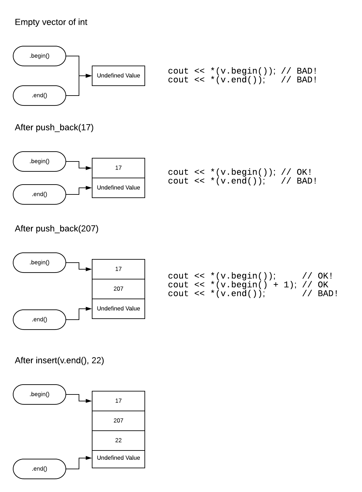

# Insertion Sort

This project expands on the introduction to the use of `vector`. You will implement an Insertion Sort and use it to sort of `vector` of randomly assigned integers.

## Other new material

Looking at `vector.insert()` means that you'll also be exposed to `iterators`. Iterators are kind of like using an index to address a specific element in a container but this is an over simplification.

Containers can be far more complex than an array of contiguous elements. Picking out one element can likewise be more complicated than you might expect. The notion of a generalized iterator was invented to hide the differences and / or complexities of moving around within a container.

The following picture introduces the idea of the iterators returned by a vector's `.begin()` and `.end()` methods.



Notice the interesting syntax in:

```c++
*(v.begin())
```

`v.begin()` is an iterator *pointing to* the first value in the vector. If `v.begin() == v.end()` the vector (and other containers) is empty.

`*(v.begin())` is the value itself. That is, `*(v.begin())` is 17.

`v.end()` returns an iterator which is one element **beyond** the last valid element.

## Starter code

I [provide starter code](./starter_code.zip) which indicates precisely where you are to write code. Use the link just given to download the zip file. Below is a copy of the starter code (which may or may not be current) for discussion purposes.

```c++
#include <iostream>
#include <iomanip>
#include <vector>
#include <ctime>

using namespace std;

/*	Print() - this function... write big picture comment here.

	Parameters:
	string			printed before the data
	vector<int> &	A reference to a vector of int

	Returns:
	void				No return value
*/

void Print(string title, vector<int> & values) {
	// You write this

}

/*	Write function comment in style of above.
*/

void Insert(vector<int> & values, int value) {
	// You write this
}

/*	Write function comment in style of above.
*/

void InsertionSort(vector<int> & values, const size_t size, const int max_value) {
	// You write this
}

int main() {
	const size_t vector_size = 64;
	const int max_value = 65536;
	vector<int> values;

	srand((unsigned int) time(nullptr));
	InsertionSort(values, vector_size, max_value);
	Print("After", values);

	return 0;
}
```

### Ampersands `&` are critical

While the `&` are not explained yet, they are critical. Ensure that you do not remove them.

### Commenting is graded

I have modeled a partial function comment and you are to complete it as well as to write others as indicated.

A function comment's text should provide the *big picture*. In terms of strategy versus tactics, the function comment describes strategy. Comments mixed in which code describes tactics.

### `main()` is to be used as-is

Your job is to write only what is indicated. `main()` isn't to be modified.

## Insertion sort algorithm

An insertion sort is an **inefficient** method of sorting whereby the collection is iterated over repeatedly as each element is added in sorted order.

The idea is that a new element is inserted immediately *before* the first element which is larger than the one to be inserted.

There may be a wrinkle to this.

### `InsertionSort()`

This function executes a loop that calls `Insert()` `size` times. Each time through the loop, it calls `Insert()` once passing it an integer value between 0 and `max_value` chosen at random.

### `Insert()`

This function implements the actual insertion sort of one new element.

### `Print()`

This function prints the vector and must do so obeying the rules that:

1. Only 8 numbers are printed per line.
2. Each number is printed in a cell that is 8 characters wide. See zybooks chapter 9.3.

## Sample output

Note that due to random values, your output will be different.

```text
After
     287    2087    2404    2606    3058    4703    4781    5355
    6270    6988    7356    9029    9577    9611   11594   11757
   15313   15895   16677   17253   17711   17852   17972   18368
   18479   18652   21023   21578   21659   22452   23500   24283
   25471   25956   27337   28272   30366   35270   36935   37398
   37544   38333   39085   40176   40907   40974   41839   42367
   42854   43790   44473   45685   46053   46488   47732   49838
   51360   54434   54823   56459   59125   62841   63609   63671
```

You will note that every number is printed right justified in a cell 8 characters wide. This type of formatting is described in zybooks chapter 9.3. You gain access to this type of formatting by including `iomanip` (as provided in the starter code).

Further, note that every line includes exactly 8 numbers. Since `vector_size` is 64 (a multiple of 8), the printout must end with a complete line of 8 numbers.

## Partner rules

This work is to be done **SOLO**. All students are to hand in their own work.

## Remember comments

Commenting is part of your grade in this (and future) projects.

