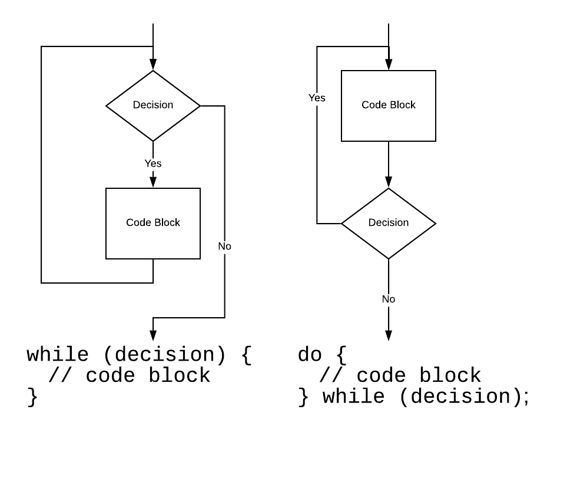

# A fortune printer

In ancient times, there was a program called `fortune` which printed a witty or, more often, obscure saying from the early Unix culture. You will write just such a program.

You must download the `fortunes.txt` file.

## Include files to be used

```c++
#include <iostream>
#include <fstream>
#include <vector>
#include <string>
#include <ctime>
```

## Members of `ifstream` that you will use

| method | described in |
| ------ | -------- |
| `open()` | zybooks 9.5 |
| `is_open()` | not in zybooks - see below |
| `tellg()` | not in zybooks - see below |
| `seekg()` | not in zybooks - see below |
| `good()` | zybooks 9.6 |
| `clear()` | zybooks 9.6 |

### `is_open()`

This boolean method returns true if the `ifstream` or `ofstream` is open.

```c++
ifstream file('filename');
if (file.is_open()) {
    cout << "happy day!" << endl;
    file.close();
} else {
    cout << "file could not be opened" << endl;
}
```

### `tellg()`

This returns the number of *next* byte to be read / written or -1 if there is an error.

```c++
cout << "The next byte to be read is located at offset : " << file.tellg() << endl;
```

### `seekg()`

This method changes the location of the next byte to be read / written or returns -1 if there is an error. The first parameter is an offset relative to the second parameter which could be the beginning of the file, the end of the file or the current position.

```c++
// Read the first line
getline(file, line);
// Read the first line again
file.seekg(0, file.beg);
getline(file, line);
```

## Algorithm to be used

1. Ask for the name of the file.
2. Attempt to open the file. Print an error message if the file cannot be opened and exit.
3. Read the entire file using `getline()` using `tellg()` to learn the character offset of the beginning of each line. I suggest a `do / while` loop. Make a vector to hold all the offsets.
4. Select a member of the vector at random - seek to the location checking to make sure it worked.
5. `getline()` the fortune, print it out.
6. `close()` the file.

The idea is that you read the entire file line by line but do not store all the lines. Instead you are storing the byte offset from the beginning of the file to where each line starts into a vector. Then choose a random number between 0 and the size of the vector minus 1. That entry in the vector contains the `seekg()` value for the randomly chosen line.

## Steps in using a file

1. Attempt to `open()` the file.
2. Test if the file really is open. Handle error if not.
3. Use the file.
4. `close()` the file.

Failure to do (2) above results in *instaten* - an immediate 10 point reduction.

## do / while loop

Here is the different between a `while` loop and a `do / while` loop.


Or, another way:



## Examples of output

### Bad file name

```text
pk_fortune2 $> ./a.out
Enter fortune file's name: oijoijoij
Could not open file: oijoijoij
pk_fortune2 $>
```

### Example of good file name

```text
pk_fortune2 $> ./a.out
Enter fortune file's name: fortunes.txt
Lines read: 4579
Selecting fortune: 3657
Lucent in Motion is almost in full swing.
pk_fortune2 $> 
```

## Work rules

Work is to be done solo.

## Commenting is graded

Function comments are expected at least.
