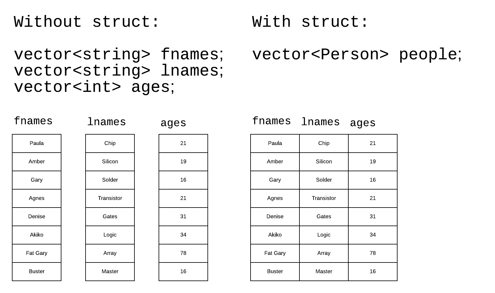

# Introduction to structs

You by now have lots of practice with built-in types such as `float`, `int`, etc. You also have practice with incorporating these basic types into certain containers such as `vector`.

Now comes time to create your own type.

`struct` is a means of building a more complicated type from simpler parts. `struct` was introduced in C. In C++, structs were promoted to being nearly identical to the powerful C++ feature `class`. In fact, everything you learn in this project about `struct` can be applied (with next to no changes) to reimplimentation using `class`.

Suppose we wanted to model a collection of "people" using strings for first name and last and plus an integer for age. Without structs we must resort to using three data structures. This is awkward and error prone.

With a `struct` we can join all the three attributes we wish to model about people into a single unit.



## Defining a `struct`

Continuing from the example above:

```c++
struct Person {
	string fname;
	string lname;
	int age;
};
```

Then, the `struct` can be used like any type:

```c++
// Make one person.
Person p;
// Make a vector of persons.
vector<Person> people;
```

## Accessing members of a `struct`

There is more than one syntax for accessing members of a `struct`. The basic form is (assuming `p` as defined above):

```c++
cout << p.fname << " " << p.lname << " " << p.age << endl;
```

## The `struct` in this project

```c++
struct Student {
	string fname;
	string lnage;
	string student_id;
	int age;
	vector<int> scores;
};
```

## The data in this project

You will have written a program to generate your own data. Your data must look like this (discounting random choices for name, age and scores):

```csv
Eugenio,Riley,00044249,20,87,91,86,79,96,33,88,96
Engelmann,Caroline,00038445,19,75,95,72,84,97,75,29,72
Riebow,Anya,00008913,18,88,75,100,93,90,76,95,70
Rades,Ana,00056037,18,98,28,95,97,79,100,75,87
Kuehni,Willa,00062445,19,85,86,94,77,71,72,70,97
Perciballi,Jamal,00024575,18,84,93,79,76,95,98,82,42
Schuhmacher,Autumn,00019066,18,83,100,95,90,72,86,70,96
Hade,Julien,00052210,19,83,87,93,28,86,82,76,86
Goyal,Ali,00003061,20,96,87,76,85,80,97,78,93
Baster,Pierce,00032520,21,91,74,94,80,74,80,82,81
Villaverde,Serena,00051362,18,71,33,97,97,73,73,85,95
```

The columns are:

| index | meaning |
| ----- | ------- |
| 0 | last name |
| 1 | first name |
| 2 | student id |
| 3 | age |
| 4 | score[0] |
| 5 | score[1] |
| 6 | score[2] |
| 7 | score[3] |
| 8 | score[4] |
| 9 | score[5] |
| 10 | score[6] |
| 11 | score[7] |

The file, as can be seen, is a `csv` file. You are provided with a csv splitter.

If you wrote the program that creates your data file correctly, you can assume no problems in the data - i.e. you do not have to include code in this project that checks for data to be formatted properly. Note, I will be grading your project with my own data file. If any problems crop up, you'll be penalized.

## Specifying the file

The file name is to be provided to your program via the command line. Remember to ensure that the command line argument is provided. A quick way to lose points is to simply assume the argument is present.

If the file is absent or cannot be opened, print a message and exit. As this is an error, the return code from `main()` must be `1` and not `0`.

Further, as this is an error, use `cerr` to print an appropriate message and not `cout`.

## Menu

After reading the file, you will *repeatedly* offer the user a menu of actions they can take. This should be in a loop which ends when either a) the user enters the EOF (end of file) character or b) the user enters `q`.

### Actions

| mnemonic | action |
| -------- | ------ |
| mh | find students who have more than one 100 |
| ha | find the students who share the highest average |
| z | find students who have at least one zero |
| q | quits the program |

### Averages are rounded

For the purpose of the `ha` command, round the computed average to the nearest integer using the `round()` function found in `cmath`.

## Samples of all cases

Of course, your particular results will be different since you will be using different data. As a consequence of this - you should test with a small data set of perhaps no more than three students whose values are set by hand - so that you can confirm your results.

No file given:

```text
pk_intro_to_structs $> ./main
A file name must be provided.
pk_intro_to_structs $>
```

Bad file name given:

```text
pk_intro_to_structs $> ./main okokokok
Could not open: okokokok
pk_intro_to_structs $>
```

File loaded - commands run:

```text
pk_intro_to_structs $> ./main data.csv
500 student records loaded.
Menu:
mh - find students with more than one 100
ha - find all students sharing highest average
z  - find students with at least one zero
q  - quit the program
Your choice: mh
Students with more than one one hundred:
   Weisensel       Diana  00025519 has 2 scores of 100
       Lutzi       Chloe  00037540 has 2 scores of 100
     Krasley    Kadiatou  00017899 has 2 scores of 100
      Fazzio       Aiden  00054363 has 2 scores of 100
      Patina     William  00008354 has 2 scores of 100
       Obear         Noa  00001989 has 2 scores of 100
    Bultinck        Alec  00051335 has 2 scores of 100
Menu:
mh - find students with more than one 100
ha - find all students sharing highest average
z  - find students with at least one zero
q  - quit the program
Your choice: z
Students with at least one zero:
    Steffens      Landon  00056329 has 1 zero
  Cagliostro     Michael  00033670 has 1 zero
  Ignatovich    Theodore  00005524 has 1 zero
     Teodoro    Anderson  00036037 has 1 zero
       Geroy       Silas  00015365 has 1 zero
Menu:
mh - find students with more than one 100
ha - find all students sharing highest average
z  - find students with at least one zero
q  - quit the program
Your choice: ha
The highest average is: 93
Held by these student(s):
   Hoffpavir        Emma  00019118
     Bonwell        Milo  00029597
Menu:
mh - find students with more than one 100
ha - find all students sharing highest average
z  - find students with at least one zero
q  - quit the program
Your choice: q
pk_intro_to_structs $>
```

In the above print-outs, first and last names are set to 12 spaces in width via `setw()`. The student id number is set to 10 spaces in width.

## Suggestions for functions for you to write

### `PrintMenu()`

This function just prints the menu you see above. Mine has this signature:

```c++
void PrintMenu();
```

### `FindZeros()`

This function handles all of the chore of finding all students who have at least one zero. Mine has this signature:

```c++
void FindZeros(vector<Student> & students);
```

### `FindAverage()`

This function computes and rounds the average of the `scores` in each `Student`.

Mine has this signature:

```c++
double FindAverage(vector<int> & scores);
```

### `FindHighestAverage()`

This function handles all of the chores needed to find all students sharing the highest average.

Mine has this signature:

```c++
void FindHighestAverage(vector<Student> & students);
```

## Work rules

All work is to be done solo.

## Setting expectations

My implementation has 140 lines. This is not a challenge or test. This information is given only to allow you to scale your expectations. If you're exceeding this number of lines *by a lot* maybe you should rethink what you're doing.
