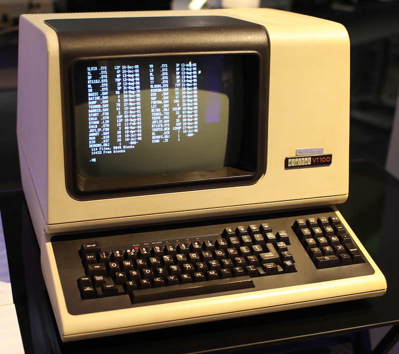

# Retro Snow

This program implements a simple particle system which approximates falling snow using *curses* and asterisks.

## A particle system

A particle system...

[Here](https://www.youtube.com/watch?v=mAHIKxu7pnw) is a youtube video with some cheesy particle system demos with overly dramatic music and a very bored narrator. Turn off the sound.

A particle system is a great way to introduce object oriented programming since each and every particle will be an instance of a `class`. In our case, we'll use a `struct`. In C++, `structs` and `classes` are the same with a small difference that does not concern us here.

zybooks chapter 7 introducts classes. `structs` work the same way except `structs` *default to `public`*

`structs` and `classes` can contain more than just a definition of the data that lives inside them - they can also provide code that acts on the data.

Your will be creating two kinds of objects.

* `Flake` represents one snowflake.

* `Storm` represents all the snowflakes in the particle system.

### **REQUIRED** `structs`

#### Flake

Here is your specification for `Flake`. Note these the following only specifies the signatures of the **required methods* in `Flake` and not any code. See the zybooks chapters.

```c++
struct Flake
{
	Flake();
	Flake(int c, int r);
	void Render();
	void Update();
	int FBM();

	int row;
	int col;
};
```

`Flake()` is an empty constructor.

`Flake(int c, int r)` is an alternative constructor that initializes the column and row of the snowflake.

`Render()` consults the column and row of this snowflake and places an asterisk at that location.

`Update()` computes the *next* location of the snowflake. It calls `FBM()` and tests if the new snowflake location will be outside the screen. If it is, the snowflake is reborn at the top of the screen.

`Update()` adds 1 to the row of its snowflake - **NOTE** that the top of the screen is row 0. Thus moving down the screen means higher numbered rows.

`FBM()` computes left / right offset for the next snowflake location.

`FBM` stands for Fractal Brownian Motion - FBM powers the [Infinite Improbability Drive in the Heart of Gold](https://hitchhikers.fandom.com/wiki/Heart_of_Gold). There is a forty percent chance `FBM()` will return -1. There is a forty percent chance `FBM()` will return 1. There is a twenty percent change `FBM()` will return 0.

The return value of `FBM()` is added to the column of the snowflake thus making it move to the left, right or stay in the same column.

#### Storm

```c++
struct Storm
{
	Storm(int n);
	void Render();
	void Update();

	vector<Flake> flakes;
};
```

`Storm(int n)` is the constructor of a whole storm. The parameter `n` is the number of snowflakes to create. I suggest the value of `n` be set to twice `COLS`. Remember, you do *not know* what `COLS` is until after executing `initscr()`.

`Storm()` puts the newly made snowflaks onto is `vector`.

The initial value for a flake's column ranges between 0 and COLS inclusive. The initial row should be a small negative random number so that the flakes do not all fall along the same row.

`Render()` for the `Storm` calls `Render()` for all the flakes in the storm.

`Update()` for the `Storm` calls `Update()` for all the flakes in the storm.

## Curses

Back at the dawn of time, communications between *glass ttys* and computers was very slow. Amazingly slow. A hardwired terminal might run at 9600 *baud*. This is just about 960 characters per second. Terminals hooked up by phone ran at 300 baud or 30 characters per second. Terminals had a standard size of 80 columns by 24 rows - punched cards, by the way, were 80 columns wide. Thus a terminal had 1920 character positions on a screen.

A hardwired terminal could therefore update all character positions once every 2 seconds.

A phone-connected terminal could update all character positions once every 64 seconds!

 *This is a DEC VT100 terminal displaying what appears to be an RT11 directory listing. Man, I'm old.*

Minimizing the number of characters sent to a terminal was extremely important. curses was written at UC Berkeley as part of BSD Unix by Ken Arnold for things such as ```rogue``` and ```vi```.


The ```curses``` library puts a buffer between you and the terminal. Instead of writing to the screen, you are writing to the buffer. **No updates to the screen happen until you refresh the screen.**

When you refresh the screen, ```curses``` steps in and compares the current contents of the screen to the desired new contents. It will then compute exactly how to send  the fewest number of bytes down the wire to cause the old screen to look like the new screen.

## Curses set up

Initialize ```curses``` like so:

```c++
initscr();
curs_set(0);
```

## Tearing down curses

Tear down ```curses``` with:

```c++
curs_set(1);
endwin();
```

## Getting user input

The set up code above sets things up so that user input is *not* echoed. Also, there is *no waiting* for user input. You can use ```getch```. Hint: don't think just because the function name suggests it will return a ```char``` that it actually does.

## Don't clear the screen, erase it

```clear()``` and ```erase()``` both clear the internal buffer. However, ```clear()``` does it in a more visible way. Please take a moment to appreciate how absurdly the previous sentence is constructed.

## "Windows"

Using only ASCII characters, you can create a surprisingly good windowing experience. ```curses``` supports its own concept of windows.  The default window is called ```stdscr```. You are using it with any of the standard ```curses``` functions. There are variations of these functions that take a window pointer as an argument to perform the same thing but on the non-default window.

### Using ```stdscr``` and specifying a window explicitly

For example, here are the cousins of ```addstr``` most commonly used:

```c++
int addstr(const char *str);
int waddstr(WINDOW *win, const char *str)
int mvaddstr(int y, int x, const char *str);
int mvwaddstr(WINDOW *win, int y, int x, const char *str);
```

(The ```mv``` forms allow combining the placement of strings with moving to the first character position. *Note these are C strings not C++ `strings`!*)

## Back to windows

Note the ```w``` in:

```c++
int waddstr(WINDOW *win, const char *str)
int mvwaddstr(WINDOW *win, int y, int x, const char *str);
```

These forms allow you to specify a window other than ```stdscr```.

You will use a second ```curses``` window to ask for file names for the load and save features. You will probably use these functions (plain list - does not show parameters):

* ```newwin()```
* ```werase()```
* ```mvwaddstr()```
* ```wrefresh()```
* ```wgetnstr()```

## Remember you configured curses keyboard behavior

Up above in the section marked **Curses set up**

## Differences between Windows and Mac

### Includes

You must put this near the top of your program:

```c++
#ifdef _WIN32
#include <Windows.h>
#undef   MOUSE_MOVED
#include "curses.h"
#else
#include <unistd.h>
#include <ncurses.h>
#endif
```

### Delaying

Windows and Mac have different ways of programs putting themselves to sleep for a short time. Anytime platforms implement something basic like this so differently, it causes problems.

Here is the old way of dealing with platform differences:

```c++
void Delay(int milliseconds = 16) {
#ifdef _WIN32
    Sleep(milliseconds);
#else
    usleep(1000 * milliseconds);
#endif
}
```

The lines that begin with `#` are *preprocessor* commands. These lines say, essentially, "If you're on Windows sleep one way and if not, sleep another way."

With that said, there is now a [new way](http://www.cplusplus.com/reference/thread/this_thread/sleep_for/) of dealing with time in a *platform agnostic* way. Referring to the example given on the page just linked, `seconds` would be replaced with `milliseconds` and the `1` replaced by `60`. That is, the screen will be updated every 60 milliseconds (or slightly longer).

### Making use of the curses library

#### Mac

In xcode, add curses as a framework to your build.

1. Click on the project in the file view
2. Click on General
3. Click on the plus sign in Frameworks and Libraries
4. Type "ncur" in the search field
5. Click "libncurses.tbd"
6. Click "Add"

At this point the program should build barring any of your own errors. However, it will not run under the debugger.

#### Windows

## Linking with curses

### Windows

Available for download with this project is a zip file called `windows.zip`. Download and unzip this file. It contains:

* `panel.h` - an include file which will not be used in this project but must be installed where your source code is placed.

* `curses.h` - an include file giving access to this curses library.

* `pdcurses.lib` - a library file - this is the file that you must link with.

* `pdcurses.dll` - a dynamically loaded library containing the actual code for pdcurses - this file must be put where your executable is.

In Visual Studio you link as follows:

1. Click on menu item Project -> Properties
2. Dial down `Linker`
3. Click on `Additional Dependencies`
4. Click on downward facing arrow at right of this line
5. Click on `<Edit...>`
6. In top text box type `pdcurses.lib`
7. Click `OK`
8. Click `OK`
9. Put `pdcurses.lib` where your source code is
10. Barring your own problems, your program should now build

To allow running:

1. Put `pdcurses.dll` where your source code is
2. Barring your own problems, your program should not build

### Debugging

#### Mac - running in an external console with the xcode debugger

It took several years before I figured out the following so please take a moment to reflect upon how dedicated I am :)

From the menu: `Product -> Scheme -> Edit Scheme`:

1. Click "Run - Debug"
2. Click "Launch: Wait for executable to be launched"

Back to the Build configuration:

1. Click on the project in the file view
2. Click on Build Phases
3. Click on the plus sign above "Dependencies"
4. Choose "New run script phase"
5. Erase the text under "Shell /bin/sh
6. Enter "open /System/Applications/Utilities/Terminal.app"

When you launch your program in the debugger it will state in the top middle box that it is waiting. It will also have opened a terminal window.

In the terminal window, navigate to where your executable is and run it. To find your executable is itself an adventure in pointless Apple obfuscation. The following is done only once (and before you built your program):

1. In menu XCODE -> Preferences choose the Locations tab
2. Under Derived Data, choose Advanced
3. Choose Custom
4. Choose Relative to Workspace
5. Click Done
6. Close the Preferences dialog

Now your executables will be found underneath your project folder in Build / Products / Debug.

To run your executable you must prepend `./` to its name when you type in the terminal window.

Doing so will allow you to run your program in an external console under the xcode debugger.

#### Windows

There is nothing else you need to do to debug. Take a moment to reflect upon how much easier this is that the rediculous hurdles the designers at Apple chose to place in your way. They don't care. Their poop smells like cotton candy and sunshine.

## Work rules

Work solo.

## Setting expectations

My implementation is 110 lines. This is not a challenge and is provided only to set expectations. If your code is 200 lines, you're doing it wrong.


