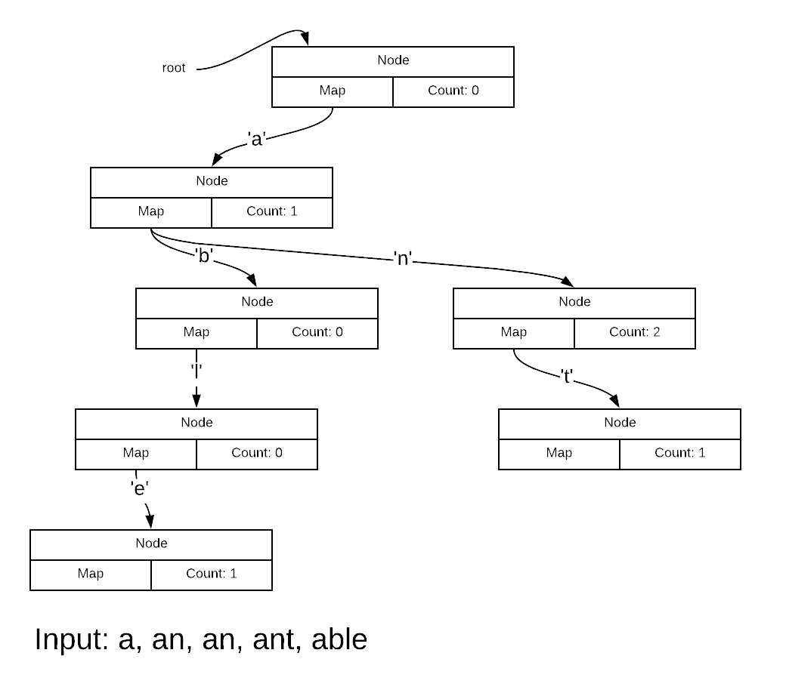

# Word counter using tries

An 1820 project for dynamic memory allocation and pointers using a *trie* data structure. This project also uses *maps* to organize a node's pointers to its children.

A trie is a *tree* structure with an ingenious difference. In a tree data structure, *nodes* make up the branches of the tree by pointing to other nodes or to leaves. A complete copy of the data is stored in the leaves. All non-leaves just store pointers to other nodes or leaves.

In a trie, data is broken into small pieces which are embedded directly into nodes. A complete data item is not stored anywhere in the tree. Rather, a complete data item is constructed by concatenating that data piece stored in each node.

Here is an example of the kind of trie you make in this project.



Here is a video talking through how this trie is made by your code.

[Example Trie Video](https://vimeo.com/316427859)

## The role of maps in this project

Each Node in the trie is defined by this class:

```c++
#pragma once
#include <map>
#include <string>

class Node {
public:
    Node();
    ~Node();
    void AddWord(std::string word);
    void Enumerate(std::string prefix);

private:
    std::map<char, Node *> child;
    int count;
};
```

Be reminded that it is a poor practice to include ```using namespace``` in an include file because it takes a choice away from the programmers who incorporate such an include file.

Each node contains a ```map``` which maps a ```char``` to a Node pointer. In the picture above, the root Node has only a single entry in its map corresponding to the key "a". That is, there is a ```pair``` which has "a" as its ```first``` and a pointer to the Node lower down for its ```second```.

The Node on the second layer has entries for both letter "b" and "n".

## Recursion will be vital

A trie is a tree structure - this means recursion will be your friend. Recursion here means that at every appropriate node, you repeat the same steps as you performed at its parent.

For example, to enumerate the trie (print out its contents) will be something like:

```text
ENUMERATE(STRING S)
    IF COUNT > 0 PRINT S AND COUNT
    FOR EACH KEY / CHILD NODE
        CHILD NODE -> ENUMERATE(S + KEY)
```

See the recursion there?

AddWord will be something like:

```text
ADDWORD(STRING S)
    IF THE STRING IS EMPTY INCREMENT COUNT BECAUSE END OF WORD
    ELSE
        THE KEY IS THE FIRST LETTER IN S
        IF THE KEY IS NOT ALREADY FOUND
            ADD KEY POINTING TO NEW NODE
        ADDWORD ON NEW NODE WITH REST OF STRING (I.E. W/O FIRST LETTER)
```

See the recursion here too?

### Recursion must be built into the destructor too

You are required to ```delete``` every Node that was ```new```ed. In the Node destructor, you have to call ```delete``` any Nodes pointed to by the current
Node. Iterating over a container for the purposes of removal can sometimes
cause bugs. Rather than iterating like with a ```for``` loop, use a ```while```.

Kinda of like:

```text
DESTRUCTOR
    WHILE THERE ARE CHILDREN LEFT
        DELETE THE FIRST CHILD
        ERASE THE FIRST CHILD (NOW THERE IS ONE LESS IN CONTAINER)
```

## Two global counters

You must keep track of the number of Nodes added to the root and the number of Nodes deleted. These must be printed out. The number of Nodes added does not include the root itself so this value should be *one less than the number of delete's since the root must be deleted too*.

### ```extern``` - assuming you code more than one C++ file

Define these globals:

```c++
int delete_counter = 0;
int node_counter = 0;
```

in main.cpp.

In your node.cpp, add:

```c++
extern int delete_counter;
extern int node_counter;
```

The ```extern``` declarations in node.cpp cause the *linker* to look through the other compiled files in your program looking for matching *definitions*.

Please watch this video to understand the compilation process.

[Compilation Video](https://vimeo.com/316438173)

When you make a global such as in file 1:

```c++
int delete_counter = 0;
```

You are saying to the linker "file 1 is offering a definition of ```delete_counter```.

When you say:

```c++
extern int delete_counter;
```

in file 2, you are telling the linker "file 2 is asking for ```delete_counter``` defined by another file - can you match file 1's offer to file 2's need?"

### Externed globals aren't a suggested practice

In general, this practice is frowned upon because in file 2, the variables imported from file 1 seem like they have been air dropped in without explanation. A preferred practice is to avoid globals altogether by using parameter passing. Sometimes this cannot be done.

Suppose for example, you want to implement ```delete_counter``` in an actual destructor (you do in this project). Destructors don't take arguments. While there is a way to avoid the extern'ed global, I decided to use the method outlined here because of its simplicity.

## Running and testing the program

You need to specify a file that will contain the words to be processed. This
file will be identified on the command line. This will force you to learn some
Linux command line and how to get arguments into your program from the command line.

### ```argc``` and ```argv```

Recall the full version of the ```main``` function:

```c++
int main(int argc, char * argv[])
```

| argument | meaning |
| -------- | ------- |
| argc     | The number of command line arguments - always at least one |
| argv     | An array of length ```argc``` containing pointers to C strings |

Here is a video on how ```argc``` and ```argv``` work. See if you can make any sense of it.

[argc / argv Video](https://vimeo.com/204092503)

In this project, you must exit the program if the word file is not given. In ```main.cpp``` do something like:

```text
int retval = 0;
if (argc != 2) {
    cout << "Usage: <program name> <word file>" << endl;
    retval = 1;
} else {
    // Rest of your program - argv[1] should be used as the word file name.
}
return retval;
```

Watch this video:

[running Video](https://vimeo.com/204092503)

## Running the program

Run the program by specifying the name of the input file as the command line argument. For example:

```text
$> ./a.out words.txt
```

## Program output

Your program is to output the entire trie (after building it, of course) followed by some sanity check values.

The following is the last 20 lines of output when the program is run with `words.txt`. The last four lines are the sanity check values. These are:

* the total number of words loaded, 
* the number of nodes created (not including the head node)
* the number of times that the node destructor was called (which will include the head node so this value should be one larger than the previous one above)
* if the destructor count is one more than the number of nodes, then print `Correct!`

```text
$> ./a.out words.txt | tail -n 20
Word: yield count: 5
Word: yielded count: 3
Word: yon count: 1
Word: you count: 551
Word: young count: 29
Word: younger count: 9
Word: youngest count: 1
Word: youngster count: 1
Word: your count: 248
Word: yours count: 4
Word: yourself count: 28
Word: yourselves count: 1
Word: youth count: 21
Word: youthful count: 3
Word: zeal count: 4
Word: zip count: 1
Number of words loaded: 78533
Number of Nodes: 23941
Number of times Node destructor was called: 23942
Correct!
```

## Hints

### Test small at first

Don't try to test with `words.txt` at the beginning. It's pointless. Instead test with a tiny file with no more than a couple of lines.

### Completely understand the `Node` class and what a trie is

Don't even begin the program without understanding the `Node` class and what a trie is. Just. Don't. 

Using pencil and paper, draw some tries while role playing added a couple of words.

### Instrument your code during test

Programs that involve tree-like dynamically allocated data structures are easy to get lost in. Build in code to help you debug. Before turning in your project, disable the test code by commenting it out, using `#ifdef` or another method.

## Partner rules

This project is to be done individually.

## Warnings

As usual, any warnings result in an instant 10 point reduction. Your code will be compiled with `-Wall`.
