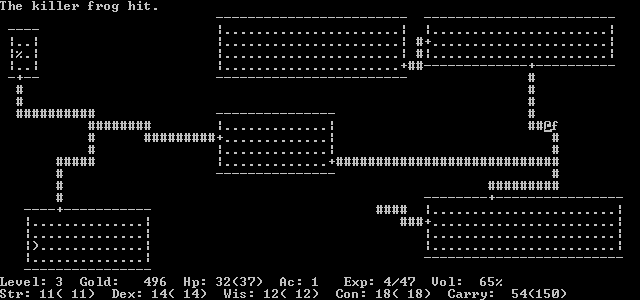

# Conway's Game of Life

You are to implement [Conway's Game of Life](https://en.wikipedia.org/wiki/Conway%27s_Game_of_Life).

* You will use ```ncurses``` (on Mac and Linux) and ```pdcurses``` (on Windows).

* You will use classes. Some class definitions are up to you. Some are predefined.

* You must use dynamic memory allocation for your boards.

* You must comment your code adequately according to good practices.

* You must implement various features exactly as I describe in this specification.

## Game features

You must implement the following commands within the game:

```p``` pauses and resumes the evolving onscreen life.

```q``` quits the program.

## Wrap-around

The universe in which the life lives is wrap-around. The opposite borders are adjacent to one another. The left and right edges are adjacent to each other as are the top and bottom.

## Board class

The memory used to store a board is housed in this class. 

Keep in mind that ```curses``` has two global variables ```LINES``` and ```COLS``` that become defined only after ```curses``` has been initialized via ```initscr()```.

Therefore, your ```Board``` instances cannot be initialized until after `initscr()` has been called. Because you have to wait until the program is already running before you can fully declare memory for the boards, the boards must be dynamically allocated.

## Dynamic memory allocation and pointers

You have been accustomed to using statically defined data structures.

```text
struct Inning {
  // members and methods
};

Inning box_score[9];
```

In many instances, the world is not quite so simple. We might not know how many of a thing we need before the program starts. You learned about ```vector``` as a means of having a data structure than you could expand as needed. You didn't see it directly, but each ```push_back``` resulted in some memory being allocated at run-time. This is called dynamic memory allocation.

In ```c++``` there are two reserved words which explicitly manange dynamically allocated memory. These are ```new``` and ```delete```. In nearly all cases, anything you ```new``` must also ```delete```.

## Sizing the board

The board is logically a 2D array. In C++, a 2D array cannot be declared using the normal syntax and also sized dynamically.

The spots in your board will be called ```cells```. You cannot do this:

```c++
char cells[LINES][COLS];
```

This cannot be used because ```LINES``` and ```COLS``` are not constants. This syntax can only be used when the sizes are constant.

In memory, there are no actual 2D constructions. Only 1D. To get the effect of a 2D array, two kinds of architectures are typically used. These are shown below.


The first is what you get by default. When you refer to ```A[r][c]``` the compiler emits code to convert your 2D indexes into 1D indexes. The conversion is simple. The address of ```A[r][c]``` is computed with:

```text
A + 3 * r + c
```

The *value* of ```A[r][c]``` is given by:

```text
*(A + 3 * r + c)
```

**But - YOU must do this addressing yourself when you are dynamically allocating an array in this way.**

You can write your own functions to make this addressing easier for you. For example:

```c++
char Get(char * a, int width, int row, int col) {
  return *(a + width * row + col);
}

void Set(char * a, int width, int row, int col, char v) {
  *(a + width * row + col) = v;
}
```

Here, `a` is the base address of the array's memory. Notice that height is not needed, only width.

Here is how this kind of 2 line (row) and 3 column array would be created:

```c++
char * A = new char[6];
```

The value of 6 is simply the width times the height.

If you want to continue to use the nice bracket-based syntax with a dynamically allocated array you have to declare the 2D array differently. The downside is very slight - a little extra work in allocating and deallocating.

```c++
char ** A;
```

```c++
// Allocation
A = new char *[lines]();
for (int i = 0; i < lines; i++)
    A[i] = new char[columns]();
```

This makes the arrangement depicted in the second picture above. Now when you say ```A[1][2]``` you are accessing the second pointer to an array of 3 chars. Think of this as ```A[1]``` and ```[2]``` separately. The benefit in doing this is you get to continue using the nice bracket-based syntax. ```A[1]``` gets you to the second point in ```A```. Then, the ```[2]``` gets you to the third member of what ```A[1]``` points to.

Because Conway's Life's rules cause the 8 neighbors of every cell to be checked, I suggest using the dynamically allocated 2D array method (the second one above) rather than the first so that you can continue to use the bracket notation. 

**Even so, you must take care because the world wraps around - what is to the right of the rightmost column, for example? The leftmost column.**

Which ever way you choose to manage your dynamically allocated board, you will still have to be careful about the top and bottom rows and the left and right columns. Instead of doing the indexing yourself, **I strongly suggest you creae accessor functions to do the indexing for you**. This is much easier to debug.

For example:

```c++
/*  Return 1 if the cell to the "left" of (l)ine and (c)olumn
    is alive. Return 0 if the cell is dead.
*/

int Left(int l, int c) {
	int r = 0;
	if (c == 0)
		c = columns - 1;
	else
		c--;

	if (cells[l][c] == LIVE)
		r = 1;
	return r;
}
```

Why am I returning 1's and 0's? You have to count live neighbors, right?

As another opportunity for learning, I drop this on you:

```c++
int Left(int l, int c) {
	c = (c) ? c-- : columns - 1;
	return (cells[l][c] == LIVE) ? 1 : 0;
}
```

The two functions do the same thing. The second one is shorter - if you are motivated, you'll figure it out.

These kinds of accessors will do the wrapping around for you in one place. What do I always say?


## Deleting a board

Remember, anything you ```new``` must be ```delete```. Deleting one dynamically allocated this is done like this:

```c++
delete thing;
```

Deleting an array of dynamically allocated things is done like this:

```c++
delete [] things;
```

I state this because ```cells``` is an array. Remember, the contents of ```cells``` are pointers to other dynamically allocated things. If you use the array-of-arrays method then you must loop your deletes.

## Initializing a dynamically allocated array

Here is a bit of magic (array-of-arrays used):

```c++
A[i] = new char[columns]();  // All the new char are set to zero.
```

But

```c++
A[i] = new char[columns];    // All the new char are set to garbage.
```

## Boards class

The ```Boards``` class has an array of two ```Board``` instances. Two are required because the next generation of life is computed from the current generation. All the spots where life can exist must be acted upon *at the same time*. We can achieve the effect of this by reading from one buffer and writing to the other.

## Double buffering

You must use a technique called double buffering in this project. There is a ```front``` buffer and a ```rear``` buffer. These terms ```front``` and ```rear``` come from computer graphics where it is almost always in use. Think of ```front``` as the current buffer and ```rear``` as the previous buffer. The ```front``` buffer is the one that you can see. The ```rear``` buffer is hidden from you. At some point, the buffers are reversed where the ```rear``` becomes the ```front```.

You do not want to do copying, so instead of copying data you will simply update the relationship.

This is a **partial** example of your ```Boards``` class.

```c++
class Boards {

public:
	Board * FrontBoard() { return boards[front_board]; }
	Board * RearBoard() { return boards[1 - front_board]; }
	void SwapBoards() {
		// stuff
		front_board = 1 - front_board;
		// stuff
	}
  
private:
	Board * boards[2];
	int front_board = 0;
}
```

When you learned ```struct``` I told you that all members and methods are accessible by users of the ```struct```. This was a simplification. In a ```struct``` members and methods *default* to being accessible. They are *public*. In a class, members and methods default to ```private```. They are not usable by users of the ```class```.

In the above, what comes after ```public:``` is public and what comes after ```private:``` is private. 

You can see that the double buffering is accomplished by the integer ```front_board```. Since it can have only two values (0 and 1) you can use it to reverse the roles of front and rear. You will always read from the ```Board``` returned by ```FrontBoard()``` and write to the ```Board``` returned by ```RearBoard()```.

## Appearence

Your console window must look like:


## Curses issues

## The curses idea

Back at the dawn of time, communications between *glass ttys* and computers was very slow. Amazingly slow. A hardwired terminal might run at 9600 *baud*. This is just about 960 characters per second. Terminals hooked up by phone ran at 300 baud or 30 characters per second. Terminals had a standard size of 80 columns by 24 rows - punched cards, by the way, were 80 columns wide. Thus a terminal had 1920 character positions on a screen.

A hardwired terminal could therefore update all character positions once every 2 seconds.

A phone-connected terminal could update all character positions once every 64 seconds!

Minimizing the number of characters sent to a terminal was extremely important. curses was written at UC Berkeley as part of BSD Unix by Ken Arnold for things such as ```rogue``` and ```vi```.




The ```curses``` library put a buffer between you and the terminal. Instead of writing to the screen, you are writing to the buffer. **No updates to the screen happen until you refresh the screen.** 

When you refresh the screen, ```curses``` steps in compares the current contents of the screen to the desired new contents. It will then compute exactly how to send precisely the fewest number of bytes down the wire.

## Curses set up

Initialize ```curses``` like so:

```c++
initscr();
cbreak();
nodelay(stdscr, 1);
noecho();
curs_set(0);
keypad(stdscr, 1);
```

## Tearing down curses

Tear down ```curses``` with:

```c++
echo();
nocbreak();
endwin();
```

## Getting user input

The set up code above sets things up so that user input is *not* echoed. Also, there is *no waiting* for user input. You can use ```getch```. Hint: don't think just because the function name suggests it will return a ```char``` that it actually does.

## Don't `clear()` the screen, `erase()` it

```clear()``` and ```erase()``` both clear the internal buffer. However, ```clear()``` does it in a more visible way. Please take a moment to appreciate how absurdly the previous sentence is constructed.

## "Windows"

Using only ASCII characters, you can create a surprisingly good windowing experience. ```curses``` supports its own concept of windows.  The default window is called ```stdscr```. You are using it with any of the standard ```curses``` functions. There are variations of these functions that take a window pointer as an argument to perform the same thing but on the non-default window.

### Using ```stdscr``` and specifying a window explicitly

For example, here are the cousins of ```addstr``` most commonly used:

```c++
int addstr(const char *str);
int waddstr(WINDOW *win, const char *str)
int mvaddstr(int y, int x, const char *str);
int mvwaddstr(WINDOW *win, int y, int x, const char *str);
```

(The ```mv``` forms allow combining the placement of strings with moving to the first character position. *Note these are C strings!*)

In this project, 

```c++
int waddnstr(WINDOW *win, const char *str, int n);
int mvaddnstr(int y, int x, const char *str, int n);
```

might be very useful because they provide the length of the string explicitly. This means the array of characters pointed to by ```str``` does not have to be null terminated.

## Back to windows

Note the ```w``` in:

```c++
int waddstr(WINDOW *win, const char *str)
int mvwaddstr(WINDOW *win, int y, int x, const char *str);
```

These forms allow you to specify a window other than ```stdscr```.

You will use a second ```curses``` window to ask for file names for the load and save features. You will probably use these functions (plain list - does not show parameters):

* ```newwin()```
* ```werase()```
* ```mvwaddstr()```
* ```wrefresh()```
* ```wgetnstr()```

## Remember you configured curses keyboard behavior

Up above in the section marked **Curses set up**

## Differences between Windows and Mac

## Includes

```c++
#ifdef _WIN32
#include <Windows.h>
#undef   MOUSE_MOVED
#include "curses.h"
#else
#include <unistd.h>
#include <ncurses.h>
#endif //
```

## Delaying

Windows and Mac have different ways of programs putting themselves to sleep for a short time. For a long time this caused big headaches - anytime platforms implement something basic like this so differently, it causes problems.

Here is the old way of dealing with platform differences:

```c++
void Delay(int milliseconds = 16) {
#ifdef _WIN32
    Sleep(milliseconds);
#else
    usleep(1000 * milliseconds);
#endif // _WIN32
}
```

Have you seen the syntax in the function declaration before? It establishes the value of 16 as the default for the argument ```milliseconds```. If the argument is missing, that's the value ```milliseconds``` gets. So:

```c++
Delay();
```

and

```c++
Delay(16);
```

should do the same thing.

With that said, there is now a [new way](http://www.cplusplus.com/reference/thread/this_thread/sleep_for/) of dealing with time in a platform agnostic way. Referring to the example given on the page just linked, `seconds` would be replaced with `milliseconds` and the `1` replaced by `16`.

## Rules of Life

This is from the Wikipedia page:

* Any live cell with fewer than two live neighbours dies, as if by underpopulation.

* Any live cell with two or three live neighbours lives on to the next generation.

* Any live cell with more than three live neighbours dies, as if by overpopulation.

* Any dead cell with exactly three live neighbours becomes a live cell, as if by reproduction.

## Linking with curses

### Windows

Available for download with this project is a zip file called `windows.zip`. Download and unzip this file. It contains:

* `panel.h` - an include file which will not be used in this project but must be installed where your source code is placed.

* `curses.h` - an include file giving access to this curses library.

* `pdcurses.lib` - a library file - this is the file that you must link with.

* `pdcurses.dll` - a dynamically loaded library containing the actual code for pdcurses - this file must be put where your executable is.

In Visual Studio you link as follows:

1. Click on menu item Project -> Properties
2. Dial down `Linker`
3. Click on `Additional Dependencies`
4. Click on downward facing arrow at right of this line
5. Click on `<Edit...>`
6. In top text box type `pdcurses.lib`
7. Click `OK`
8. Click `OK`
9. Put `pdcurses.lib` where your source code is
10. Barring your own problems, your program should now build

To allow running:

1. Put `pdcurses.dll` where your source code is
2. Barring your own problems, your program should not build


## Work rules

Work is to be done solo.

